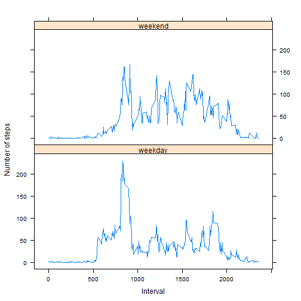

## Load and preprocess the data

```r
setwd("C:/Users/mswatson/Documents/COURSERA/")
if(!file.exists("./reproducible_research")) {dir.create("./reproducible_research")}
file <- unzip("./activity.zip", exdir="./reproducible_research")
setwd("C:/Users/mswatson/Documents/COURSERA/reproducible_research")
activity <- read.csv("activity.csv")
```
## What is mean total number of steps taken per day?
### 1. Calculate total number of steps taken per day.

```r
library(plyr)
totsteps <- ddply(activity, .(date), summarize, totalsteps=sum(steps))
```
### 2. Make a histogram of the total number of steps taken each day.

```r
hist(totsteps$totalsteps, 
     xlab="Total number of steps taken each day", 
     ylab="Count", 
     main="Histogram of total number of steps taken each day",
     col="blue")
```


### 3. Calculate and report the mean and median of the total number of steps taken per day.

```r
meanstepsNA1 <- mean(totsteps$totalsteps)
medianstepsNA1 <- median(totsteps$totalsteps)
cat("Mean total steps taken each day: ", meanstepsNA1)
```

```
## Mean total steps taken each day:  NA
```

```r
cat("Median total steps taken each day: ", medianstepsNA1)
```

```
## Median total steps taken each day:  NA
```

```r
meanstepsNA2 <- mean(totsteps$totalsteps, na.rm=TRUE)
medianstepsNA2 <- median(totsteps$totalsteps, na.rm=TRUE)
cat("Mean total steps taken each day and na.rm=TRUE: ", meanstepsNA2)
```

```
## Mean total steps taken each day and na.rm=TRUE:  10766.19
```

```r
cat("Median total steps taken each day and na.rm=TRUE: ", medianstepsNA2)
```

```
## Median total steps taken each day and na.rm=TRUE:  10765
```
## What is the average daily activity pattern?
### 1. Omit NA values in activity file.

```r
activity2 <- na.omit(activity)
```
### 2. Summarize average steps taken each interval.

```r
avgsteps <- ddply(activity2, .(interval), summarize, avg=mean(steps))
```
### 3. Make a time series plot (i.e. type = "l") of the 5-minute interval (x-axis) and the average number of steps taken, averaged across all days (y-axis).

```r
plot(avgsteps$interval, avgsteps$avg, 
     type="l",
     xlab="Interval",
     ylab="Average steps taken",
     main="Average steps taken during 5 minute interval")
```


## Which 5-minute interval, on average across all the days in the dataset, contains the maximum number of steps?

```r
maxavg5i <- avgsteps$avg[1]
for (i in 1:nrow(avgsteps)) {
    if (avgsteps$avg[i] > maxavg5i) {
      maxavg5i <- avgsteps$avg[i]
      maxint5i <- avgsteps$interval[i]
    }
}
cat("Max steps interval across all days: ", maxint5i)
```

```
## Max steps interval across all days:  835
```
## Imputing missing values
### 1. Calculate and report the total number of missing values in the dataset (i.e. the total number of rows with NAs).  
~ Fill in missing values using mean for 5 minute interval.  
~ Create a new dataset (activity3) that is equal to the original dataset (activity) but with the missing data filled in. 

```r
activity3 <- activity
nas <- 0
for (i in 1:nrow(activity3)) {
  if (is.na(activity3$steps[i])) {
    nas <- nas + 1
    x <- which(activity3$interval[i] == avgsteps$interval)
    # Assign the value to replace the NA
    activity3$steps[i] <- avgsteps[x,]$avg
  }
}
```
### 2. Report NA step Count

```r
cat("NA step count: ", nas)
```

```
## NA step count:  2304
```
### 3. Summarize average steps taken each day after imputing NA steps. 

```r
#activity3$date <- as.Date(activity3$date)
compsteps <- ddply(activity3, .(date), summarize, totalsteps=sum(steps))
```
### 4. Histogram of the total number of steps taken each day after imputing missing (NA) values.

```r
hist(compsteps$totalsteps, 
     xlab="Total number of steps taken each day", 
     ylab="Count", 
     main="Histogram of total number of steps taken each day",
     col="green")
```


### 5. Calculate and report the mean and median total number of steps taken per day using activity file with missing (NA) values filled in. 
~ Calculate mean and median total steps each day - missing (NA) values filled in 

```r
compmeansteps <- mean(compsteps$totalsteps)
compmediansteps <- median(compsteps$totalsteps)
```
### 6. Do these values differ from the estimates from the first part of the assignment? What is the impact of imputing missing data on the estimates of the total daily number of steps?  
~ Mean and median total steps each day - missing (NA) values filled in

```r
cat("Mean total steps taken each day: ", compmeansteps)
```

```
## Mean total steps taken each day:  10766.19
```

```r
cat("Median total steps taken each day: ", compmediansteps)
```

```
## Median total steps taken each day:  10766.19
```
~ Mean and median total steps each day - with missing (NA) values

```r
cat("Mean total steps taken each day: ", meanstepsNA1)
```

```
## Mean total steps taken each day:  NA
```

```r
cat("Median total steps taken each day: ", medianstepsNA1)
```

```
## Median total steps taken each day:  NA
```

```r
cat("Mean total steps taken each day and na.rm=TRUE: ", meanstepsNA2)
```

```
## Mean total steps taken each day and na.rm=TRUE:  10766.19
```

```r
cat("Median total steps taken each day and na.rm=TRUE: ", medianstepsNA2)
```

```
## Median total steps taken each day and na.rm=TRUE:  10765
```
## Are there differences in activity patterns between weekdays and weekends?  
### 1. Use weekdays() function to create new variable (day) in activity file with missing (NA) values filled in.
~ Create a new factor variable (daytype) in activity file with missing (NA) values filled in.  
~ Define all days as weekdays.  
~ Define days that are saturday or sunday to be weekends.  

```r
activity3$day <- weekdays(as.Date(activity3$date))
activity3$daytype <- "weekday"
activity3$daytype[activity3$day %in% c("Saturday", "Sunday")] <- "weekend"
```
### 2. Group data by 5 minute interval and summarize the average number of steps in that interval.

```r
activity3$daytype <- "weekday"
activity3$daytype[activity3$day %in% c("Saturday", "Sunday")] <- "weekend"
dt_agg_daytype <- aggregate(steps ~ daytype + interval, FUN=mean, data=activity3)
```
### 3. Make a time series panel plot of the 5-minute interval (x-axis) and the average number of steps taken, averaged across all weekday days or weekend days (y-axis). 

```r
library(lattice)
xyplot(steps ~ interval | daytype, dt_agg_daytype
       , type = "l"
       , xlab = "Interval"
       , ylab = "Number of steps"
       , layout = c(1, 2))
```


